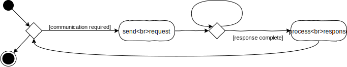

## **10 _Juni_** JSON, localStorage, Kommunikation

*[direkt zur Praktikumsaufgabe](#a--praktikumsaufgabe)*
*[direkt zu Q&A](#-qa-fragen-und-antworten)*
*[direkt zur Beispiellösung](https://plagiatus.github.io/GIS_SoSe2020/Aufgabe07/)*

## JSON (Java Script Object Notation)

JSON ist eine Syntax um Daten speichern und austauschen zu können und wurde ursprünglich für JavaScript entwickelt, aber wird von vielen anderen Sprachen ebenfalls benutzt. JSON ist ein mit JavaScript-Objektnotation geschrieber Text. JSON ist ein Datenformat in dem Daten für Menschen les-/veränderbar abgespeichert weden.

- JSON steht für JavaScript-Objektnotation
- JSON ist ein lightweight Datenaustauschformat
- JSON ist leicht zu lesen/verstehen
- JSON ist sprachunabhängig

### Daten austauschen: 
Die Daten in JSON liegen in Textform vor, und wir können jedes TS/JavaScript-Objekt in JSON konvertieren und aus JSON einladen. JSON kann auch an und von einem Server gesendet werden. Wir können jedes beliebige vom Server empfangene JSON in TS/JavaScript-Objekte umwandeln.

Auf diese Weise können wir komfotabel mit den Daten als TS/JavaScript-Objekte arbeiten.

### Daten speichern
Wenn Sie Daten in einem TS/JavaScript-Objekt gespeichert haben, können Sie das Objekt in JSON konvertieren und an einen Server senden:

```typescript
let myObj: Person = {name: "John", age: 31, city: "New York"};
let myJSON: string = JSON.stringify(myObj);
```

### Einlesen von Daten
Wenn Sie Daten im JSON-Format erhalten, können Sie diese in ein TS/JavaScript-Objekt konvertieren:

```typescript
let myJSON: string = '{"name":"John", "age":31, "city":"New York"}';
let myObj: Person = JSON.parse(myJSON);
document.getElementById("demo").innerHTML = myObj.name;
```
## Kommunikation
Kommunikation ist der Prozess des Austauschs oder der Übertragung von Information. Dabei werden zwei grundsätzliche Formen derselben unterschieden. 
### Synchron
  

Synchron bedeutet "zeitlich gemeinsam". Bei der Kommunikation heißt das allerdings nicht gleichzeitig, sondern "aufeinander abgestimmt". Das bedeutet, dass die Kommunikationspartner aufeinander warten, bis der jeweils andere seine Information übertragen hat und dann ihrerseits mit einer Übertragung beginnen. Das bedeutet zwangsläufig, dass die beteiligten Systeme die Hälfte der zur Verfügung stehenden Zeit mit Warten verbringen. Im Diagram, welches den Kommunikationsalgorithmus eines der Partner darstellt, wird dies mit der kleinen Schleife angedeutet.  

> - Sammle Beispiele für synchrone Kommunikation in deinem eigenen Alltag.  

So klein diese Schleife auch erscheint, sie kann ein großes Problem darstellen. Die Systeme könnten die Wartezeiten sinnvoll nutzen, anstatt nur in Ihnen zu verharren. Besonders problematisch wird es, wenn ein System für die Antwort lange braucht. Wenn beispielsweise eine Webseite nicht mehr reagiert, weil der Browser auf eine Antwort des Servers wartet, wird der Nutzer den Prozess bald abbrechen. **Darum sollte synchrone Kommunikation in der Implementierung, besonders bei Systemen, welche ein bemerkbare Ladezeit haben, vermieden werden, um ein Blockieren des Systems zu verhindern.**


### Asynchron
  
Daher hat sich die asynchrone Kommunikation durchgesetzt. Die Kommunikationspartner setzen eine oder mehrere Anfragen ab, damit ist ihr Teil zunächst erledigt und sie können sich um andere Aufgaben kümmern. Irgendwann kommt ein Signal, dass eine Antwort auf eine der Anfragen vorliegt. Dieses dient als Startpunkt für einen neuen Prozess, bei dem zunächst die Antwort verarbeitet wird und gegebenenfalls weitere Anfragen verschickt werden.  

> - Sammle Beispiele für asynchrone Kommunikation in deinem eigenen Alltag.
> - Was sind die besonderen Herausforderungen bei der asynchronen Kommunikation?

Damit ist es Webseiten beispielsweise möglich, die Darstellung aufzubauen und Interaktion zur Verfügung zu stellen, während weitere Daten geladen werden. Oder während der Interaktion mit dem Nutzer Daten zu versenden.

## Implementation asynchroner Kommunikation
### XmlHttpRequest-Events
Bei der asynchronen Kommunikation lässt sich wieder sehr gut die Ereignissteuerung einsetzen. Javascript bietet hierzu das Standardobjekt / die Standardklasse `XMLHttpRequest` an. Ein solches Objekt kann mit dem Schlüsselwort `new` erzeugt werden. Die Klasse bietet einige Kommandos, mit denen recht einfach eine Verbindung zu einem Server aufgebaut und eine Request verschickt werden kann. Während das Objekt die Verbindung verwaltet, erzeugt es bei Statusänderungen entsprechende Events, die wiederum mit dem üblichen Schema von Listeners abgefangen und an die zugehörigen Handlerfunktionen weitergeleitet werden. Auch die vollständige Übertragung der Serverantwort ist eine solche Statusänderung, womit dann die Clientseite einer Server-Client Kommunikation abgebildet werden kann.  
> Das XML im Namen des Objektes verrät, dass es sich dabei um eine **etwas betagte Technologie** handelt, die 1999, während der Standardisierung von HTML4, von Microsoft veröffentlicht wurde. Sie ist aber weit verbreitet und kommt noch häufig zum Einsatz. [Mehr Infos gibt es hier.](https://wiki.selfhtml.org/wiki/JavaScript/XMLHttpRequest)

### Fetch & Promises
2017 wurde die globale Javascript-Funktion `fetch` als Schnittstelle für asynchrone Kommunikation eingeführt. So kann mit einer einzigen Anweisung nach dem Muster `fetch(url [, data])` eine Request verschickt und eine Response erhalten werden. Aufgrund der Asynchronität liefert fetch aber nicht sofort die Antwort des Servers, sondern ein Objekt vom Typ `Promise`. Dies kann metaphorisch betrachtet werden: Das Versprechen, das fetch abgibt, verpflichtet dazu, die eigentliche Funktion auszuführen, in diesem Falle also zu kommunizieren, und im Erfolgsfall, sowie im Falle des Misserfolgs, bestimmte weitere Funktionen aufzurufen. Es handelt sich also wieder um eine Ereignissteuerung, die aber in einem etwas anderen Gewand daherkommt.  

Im einfachsten Fall sieht das ganze Konstrukt dann so aus:
```typescript
function communicate(_url: RequestInfo): void {
  // try to communicate
  let promise: Promise<Response> = fetch(_url);
  // establish the functions to call when communications 1. succeeds, 2. fails
  promise.then(handleSuccess, handleFailure);
}

function handleFailure(_response: Response): void {
  console.log("Failure", _response);
}

function handleSuccess(_response: Response): void {
  console.log("Success", _response);
}
```
Auch hier ist die Funktionalität über mehrere Funktionen verteilt und daher insgesamt etwas unübersichtlich. Das wird noch verstärkt dadurch, dass die Response, die den Handlern von der Promise als Parameter übergeben wird, noch nicht die Rohdaten der Antwort des Kommunikationspartners darstellt. Um die Response zu verarbeiten sind weitere Funktionen erforderlich, die wiederum Promises erzeugen, die weitere Handler aufrufen und so weiter. 
> **FunFact:** Dadurch entsteht ein Gewirr an Funktionen, das von Entwicklern als "Callback Hell" bezeichnet wird.

### Async/Await
Deswegen wurden 2017 auch die neuen Schlüsselworte `async` und `await` in Javascript implementiert. Damit wird nun etwas ganz Erstaunliches möglich: Anstatt mit der synchronen Programmierweise (eine Anweisung im Code erfolgt strikt nach Beendigung der vorangegangenen) und Events asynchrone Prozesse abzubilden und damit "Callback Hell" zu erzeugen, wird mit Hilfe der beiden Schlüsselworte die Programmierung selbst asynchron. Damit wird das fetch-Beispiel plötzlich extrem übersichtlich:

```typescript
async function communicate(_url: RequestInfo): Promise<void> {
  let response: Response = await fetch(_url);
  console.log("Response", response);
}
```
Mit dem Schlüsselwort `async` wird eine Funktion als asynchron deklariert, das bedeutet, dass ihre Ausführung unterbrochen und zu einem späteren Zeitpunkt fortgesetzt werden kann. Genau dies bewirkt das Schlüsselwort `await`, welches daher nur innerhalb von asynchronen Funktionen Sinn ergibt. Sobald `fetch` gestartet wird, wird die Funktion `communicate` zunächst beendet und die Ausführung des Programms bei der nächsten Anweisung nach deren Aufruf fortgesetzt. Sobald aber `fetch` beendet wurde, wird die Funktion `communicate` bei der Anweisung nach dem fetch fortgesetzt. Das heißt also, dass das Hauptprogramm, sofern es noch nicht komplett abgelaufen ist, unterbrochen wird um die Ausgabe der Response in der Konsole zu bewerkstelligen. Danach ist `communicate` tatsächlich am Ende und das Hauptprogramm wird fortgesetzt. Es könnten aber in der Funktion noch weitere `await`s folgen, die wieder entsprechendes Verhalten bewirken. So bläht die weitere Verarbeitung der Response den Code nicht noch wieder durch Callbacks auf.  
> - Kopiere obenstehenden asynchronen Code und bette ihn in ein neues Programm ein. Lasse vom Hauptprogramm aus die Funktion `communicate` mit dem Parameter `"https://hs-furtwangen.github.io/GIS-SoSe-2020/L07/test.txt"` aufrufen. Lasse vor und nach dem Aufruf von `communicate` in der Konsole die Zeichenketten "Start" und "End" ausgeben.
> - Starte nun das Programm, nachdem Du es lauffähig implementiert hast. Beschreibe deine Beobachtung. In welcher Reihenfolge kommen die Ausgabe in der Konsole?
> - Das ausgegebene Response-Objekt ist komplex und der eigentliche Inhalt der Serverantwort ist noch nicht zu sehen. Erweitere die Funktion `communicate` um eine Zeile, in der Du die Methode `text()` des Response-Objektes aufrufst. Achtung: text() gibt wieder eine Promise zurück. Nutzt Du aber auch hier `await` erhältst Du als Ergebnis des Ganzen eine Zeichenkette, die Du einer Variablen vom Typ string zuweist. Lasse so den Inhalt der Serverantwort ausgeben. 
> - Versuche das gleiche nochmal mit dem Parameter `"https://hs-furtwangen.github.io/GIS-SoSe-2020/L07/testjson.json"` und der Funktion `json()` statt `text()`.

> **Hinweis**: fetch erwartet immer eine `http(s)://` Anfrage, wenn ihr es also lokal testen wollt, solltet ihr einen Live-Server verwenden, da sonst die Anfrage mit `file://` beginnt.

## Local Storage:

Local Storage ermöglicht es Ihnen, Key-Value (Schlüssel-Werte) Paare lokal im Cache (Zwischenspeicher) Ihres Browsers zu speichern (ist also effektiv ein Art assoziatives Array). So können Daten über meherere Seiten einer Website hinweg einfach zwischengespeichert und wieder eingeladen werden. Die Verwendung von Local Storage ist einfacher als die Verwendung von [Cookies](https://www.w3schools.com/js/js_cookies.asp). Local Storage ist allerdings nicht ganz so mächtig wie [Cookies](https://www.w3schools.com/js/js_cookies.asp) (da Cookies nach Ablauf einer gewissen Zeit automatisch gelöscht werden). Wenn Sie möchten können Sie sich auch gerne über Cookies informieren und stattdessen diese für die Praktikumsaufgabe nutzen. 

> **Hinweis**: Wie fetch auch, muss localStorage über einen Liveserver getestet werden, da dieser sonst beim Seitenwechsel von einer lokalen Datei zu einer anderen sich selbst wieder löscht.

### Beispiel für LocalStorage:

```typescript
// Item Speichern
localStorage.setItem("lastname", "Smith");
// Item Laden
(<HTMLElement>document.getElementById("test")).innerHTML = localStorage.getItem("lastname")!;
```

### Daten wieder aus den LocalStorage löschen:

```typescript
localStorage.removeItem("lastname");
```

### Weiteres Beispiel:

HTML Teil:

```html
<p><button onclick="clickCounter()" type="button">Klick mich!</button></p>
<div id="result"></div>
<p>Klick auf den Button und der Zähler wird erhöht.</p>
<p>Wenn du die Seite schließt & wieder öffnest ist der Counter nicht zurückgesetzt</p>
```

TypeScript Teil:

```typescript
function clickCounter() {
  if (localStorage.clickcount) {
    localStorage.clickcount = Number(localStorage.clickcount)+1;
  } else {
    localStorage.clickcount = 1;
  }
  (<HTMLElement>document.getElementById("result")).innerHTML = "Du hast den Button " + localStorage.clickcount + " mal geklickt.";
}
```

_(localStorage ist eigentlich überall verwendbar, s. [CanIUse](https://caniuse.com/#feat=mdn-api_window_localstorage), aber auch hier sollte man eine Fallbacklösung haben wenn man eine "richtige" Webseite entwickelt, und wenn es nur ein "Sorry, dein Browser ist zu alt" Nachricht ist.)_

### Typescript Dokumentation

https://www.typescriptlang.org/

## **A _---_** Praktikumsaufgabe

>**Bei Problemen/Unklarheiten:** können Sie ins Praktikum kommen oder per Discord/Mail fragen stellen.

Erstellen Sie ein neues Verzeichnis und kopieren Sie die Dateien der letzten Aufgabe hinein. 

Die Aufgabe baut auf der Shop Aufgabe der letzten 3 Wochen auf. 

Ziel der Praktikumsaufgabe ist es Daten über mehrere HTML Seiten hinweg speichern zu können. In dieser Aufgabe geht es darum zu speichern, welche Artikel von einem Kunden in den Warenkorb gelegt wurden. Außerdem sollen die auf der Website angezeigten Artikel per JSON geladen werden. 

>### **Achtung!:** Beachten Sie die [<ins>Coding Style Guidelines</ins>](https://hs-furtwangen.github.io/GIS-SoSe-2020/codingstyle/). Code der diesen Guidelines nicht entpricht wird nicht akzeptiert! Code der W3 Errors oder JS-Errors aufweist wird ebenfalls nicht akzeptiert! Verstöße führen zu einer Ampelstufe 🚦

## Teilaufgabe 1

Bisher werden Ihre Artikel über ein Array, welches direkt im Code liegt, eingelesen. Änderungen sind nur dann möglich wenn Sie das Array direkt bearbeiten. Ein besserer Weg ist es deshalb, die Daten und den Code voneinander zu trennen. Auf diese Art und Weise können jederzeit Artikel hinzugefügt oder aus dem Shop genommen werden, ohne dass der Code verändert werden muss.

Erstellen Sie eine JSON Datei mit allen Ihren Artikeln. Sie können dies von Hand oder mithilfe von online JSON Generatoren durchführen oder indem Sie folgenden Hinweis beachten.

>**Hinweis:** Damit Sie die JSON nicht von Hand befüllen müssen, können Sie mithilfe von `JSON.stringify(data_array)` aus Ihrem Daten-Array ein JSON Dokument erzeugen.

Lesen Sie nun die einzelnen Artikel, welche vorher in einem Array gespeichert waren aus der neuen JSON Datei aus. 

>**Hinweis:** Die `fetch()` Methode funktioniert nur auf Servern. Wenn Sie also wie gewohnt die HTML Datei nur lokal auf Ihrer Maschine in den Browser ziehen, funktioniert `fetch()` nicht. Verwenden Sie eine Live-Server Erweiterung in VSCode (besser) oder laden Sie Ihre Aufgabe für diesen Teil hoch (schlechter) & testen Sie dann.

Erzeugen Sie anhand der eingelesenen Daten die Artikel auf Ihrer Webseite.

>**Hinweis:** Es gibt mehrere Wege wie Sie die Kategorie eines Artikels in einer JSON Datei speichern können. Sie können z.B. jeden Artikel mit einer "Kategorie-ID" versehen und die Artikel beim Einlesen der JSON sortieren, falls Sie das noch nicht getan haben.

## Teilaufgabe 2

Verwenden Sie hierfür den [localStorage](https://www.w3schools.com/jsref/prop_win_localstorage.asp) (oder die Cookies). Wenn ein User der Website einen Artikel über einen der "Kaufen" Buttons in den Warenkorb legt, soll der jeweilige Artikel im local Storage gespeichert werden. 

Legen Sie eine Warenkorb Seite an (falls Sie noch keine haben). Auf der Warenkorb Seite werden alle Artikel die ein User per Button in den Warenkorb gelegt hat dynamisch per Code generiert und angezeigt. Auf der Warenkorb Seite wird außerdem der Gesamtpreis der Bestellung angezeigt. 

User haben die Mögkichkeit einzelne Artikel zu entfernen. Jeder dynamisch generierte Artikel hat einen "Entfernen/Löschen" Button/Text.

User können ihren gesamten Warenkorb löschen. Hierfür gibt es ebenfalls einen Button, der den localStorage leert & die Artikel aus dem Warenkorb entfernt. 

## Bonusaufgabe (keine Pflicht):

User können einen Artikel mehrmals in den Warenkorb legen (z. B. 5 Äpfel). Im Warenkorb kann die Anzahl der Artikel eines Typs geändert werden.


### **Abgabetermin: Bis auf weiteres ausgesetzt. Bitte kommen Sie am Mittwoch in das Q&A.**

Bitte erstellen Sie nach Fertigstellung einen Link als oberstes Element (unter dem GitHub issues link) in Ihrer Steckbrief.htm, der auf das Ergebnis verweist (bspw. nutzername.github.io/GIS-SoSe-2020/Aufgabe_7).

>### **Achtung!:** Eine fehlerhafte Abgabe fürt zu einer 🚦 die **im Praktikum** verteidigt werden muss. Keine Abgabe zu 2 🚦 von denen nur 1e 🚦 verteidigt werden kann.

---

## **?! _<small>Q&A</small>_** Fragen und Antworten

(die Publikation der Zusammenfassung erfolgt nach dem Q&A Termin)

Zusammenfassung von: [&lt;TawsTm&gt;](https://github.com/TawsTm)

### Was muss ich in die Klammer nach dem json.parse rein machen?
Hier kommen eure Produktdaten als string rein. Diese werden dadurch wieder zu einem benutzbaren Array.

### Unterschied zwischen JSON und JavaScript?
Unterschied von JSON zu JavaScript ist Effektiv nur, dass JSON alles zu Strings und Zahlen macht.

### Was macht Stringify?
Stringify spuckt einen String aus! Den kannst du auf der Console ausgeben und dann rüber kopieren. Hier könnt ihr euch einfach Zeit sparen, weil ihr nicht alles von Hand kopieren müsst.

### Wie erstelle ich die json Datei? Muss das in mein Script oder wo hin?
Du musst Zugriff auf dein Produkt-Array haben um es einmal in der Console auszugeben und dann wieder auszulesen. In dem .json-File muss  /‘‘  durch ‘‘  ersetzt werden. Entweder durch Code oder von Hand.

### Stringify benutzt und jetzt habe ich 5 Attribute, aber sollte nicht noch Produkt vor allem stehen?
Es muss nur eine eckige Klammer auf und am Ende wieder zu machen. JavaScript ist der Typ egal.

### Braucht man die daten.ts-Datei noch?
Wenn ihr eure .json-Datei habt, braucht ihr eure Daten.ts-Datei eigentlich nicht mehr.

### Was heißt betagt bei XML?
XML ist betagt, weil es alt ist. XML wird immer weniger und JSON immer mehr verwendet. JSON ist direkt mit JavaScript verwandt. JSON ist ein flexibles Dateiformat und XML nicht.

### Die URL die wir fetchen ist unsere GIT Url?
Das geht, relativ fetchen ist aber sinnvoller, da sich dann die Url verändern kann.

### Da wo ich den parse mache, muss da mein Interface sein?
Da das Interface eurer Produkte benutzt wird, muss es immer noch beschrieben sein. Die Definition des Interfaces in einer dritten Datei ist hier aber sinnvoll.

### Ich habe ein Array von Arrays durch meine Klassenstruktur?
JSON kann nur Attribute und keine Methoden speichern. Du musst die Instanz der Klasse neu anlegen, um auf die Methoden zugreifen zu können.

### Der Unterschied zwischen Synchron und Asynchron?
Synchron ist Standard, eine Zeile nach der anderen. Sobald wir Asynchron arbeiten, sagen wir im Vorbeilaufen „lauf los“ und wir laufen bei uns weiter. Somit laufen Prozesse gleichzeitig. Wenn wir die JSON-Anfrage machen, müssen wir Awaiten, damit unser Code nicht schon weiterläuft und ihm somit die Antwort von JSON fehlt. Sonst versucht man mit einem leeren Objekt die Seite zu laden. Asynchronität ist wichtig, damit die Seite nicht einfriert, wenn wir auf den Server warten.

### Was muss in mein fetch?
Die Url deiner .json-Datei. Dies darf keine lokale Datei sein, sondern muss ein Live-Server per relativen oder einen absoluten Websitepfad aufrufen. Fetch will einen String haben, also müssen in die Klammern Anführungszeichen: fetch(„dieneDatei.json“);

### Auf was muss bei der Communicate-Funktion awaited werden?
Man muss bei fetch() awaiten und bei der Response noch einmal awaiten. Das Parsen muss nicht awaited werden.
