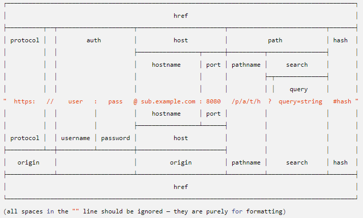

## **17 _Juni_** Serveranbindung

*[direkt zur Praktikumsaufgabe](#a--praktikumsaufgabe)*
*[direkt zu Q&A](#-qa-fragen-und-antworten)*

In [Aufgabe 7 - Kommunikation](../L07) haben wir die grundsätzlichen Formen der Kommunikation zwischen Asynchron & Synchron angeschaut. Bitte lesen Sie sich den Abschnitt `Kommunikation` erneut durch, um folgenden Abschnitt besser verstehen zu können.

## Formulare
HTML-Formulare (Forms) bieten bereits gänzlich ohne zusätzliche Programmierung die Möglichkeit, Daten synchron zu verschicken. Hierzu ist es lediglich erforderlich, dem Form-Tag ein `action`- und ein `method`-Attribut anzufügen, sowie im Formular einen Submit-Button zu integrieren. Der `action`-Wert gibt die URL an, an welche die Daten gehen sollen. Die Daten selbst, also die Werte der Formularelemente, werden bei Betätigung des Submit-Buttons automatisch aufbereitet und verschickt. Wie sie verschickt werden, hängt von der gewählten `method` ab.
### Get
Bei `method="get"` werden die Daten als Zeichenketten einfach im Klartext an den URL angehängt, mit einem `?` abgetrennt. Die Schlüssel- und Wertepaare sind mit `&` (Et, kaufmännisches Und, Ampersand) voneinander getrennt, die Schlüssel und Werte mit einem `=` verbunden. Der Browser ruft dann diese URL mitsamt Anhang auf, die komplette Zeichenkette erscheint in der Adresszeile.
> - Surfen Sie im Netz und suchen Sie nach Beispielen für die Datenübertragung in dieser Form, indem Sie die Adressezeile beobachten.
> - Testen Sie das [HTML-Formularelement](https://www.w3schools.com/html/html_forms.asp) `<form>` mit den Attributen `method="get"` und `action=""`. Der leere Wert bei `action` bedeutet, dass die aktuelle URL erneut genutzt werden soll. Fügen Sie zudem mit
```html
<button type="submit">Abschicken</button>
```

einen Submit-Button im Formular ein. Untersuchen Sie was geschieht, wenn Sie nun die Seite aufrufen und den Button betätigen.

> - Nutzen Sie nun als Wert für Action die Addresse `https://gis-example.herokuapp.com/`. Dies ist ein Beispiel für den einfachen Server den wir diese Woche entwickeln werden.

> **Hinweis** Verwenden Sie unbedingt das Attribut `name="fname"` in ihrem `<input>` Tag, da sonst `method="GET"` nicht funktioniert

> Der typ `"submit"` ist die Voreinstellung für Buttons und muss nicht explizit angegeben werden. Jeder Button innerhalb eines Formulars, bei dem nicht explizit ein anderer Typ angegeben ist, führt also automatisch zum Datenversand. Und häufig zu Verwirrung bei den Entwicklern...

### Post
Bei `method="post"` werden die Daten als eigenes Datenpaket versand und sind nicht für den Nutzer sichtbar. Post wird aber vor allem auch dann verwendet, wenn größere Datenmengen verschickt werden, da die zulässige Länge einer URL begrenzt ist. Auf der Serverseite müssen die Datenpakete zunächst erst wieder zu einer zusammenhängenden Request zusammengefügt werden.
> - Verwenden Sie nun zum Test die Methode `"post"` im Formular und betätigen Sie den Submit-Button. Versuchen Sie nun mit Hilfe der Entwicklertools die Daten zu finden. Klicken Sie dazu auf den Reiter "Netzwerk" oder "Netzwerkanalyse" und dann auf den Post-Request bei den gelisteten Anfragen.  

**Hinweis**: Versenden Sie niemals sensible Daten (logins, passwörter, etc) über GET Anfragen, da der Inhalt der Anfrage in Klartext in der URL dargestellt wird. GET wird vorallem für harmlose Suchanfragen und andere Dinge verwendet, bei denen die resultierende Seite kopiert / als Lesezeichen gesetzt werden können soll oder bei denen absolut nicht-geheime Daten verschickt/angefragt werden.

## FormData
Javascript stellt einen einfachen Mechanismus zur Verfügung um Formularelemente automatisch auszuwerten und auf die Ergebnisse zuzugreifen. Hierzu müssen die Formularelemente in der DOM-Laufzeithierarchie einem `form`-Element untergeordnet sein. Wird bei der Erzeugung eines Objekts des Typs `FormData` nun ein Verweis auf auf dieses `form`-Element übergeben, so werden deren Werte der `name`- und `value`-Attribute als Schlüssel-Werte-Paare zur Verfügung gestellt.
```typescript
let formData: FormData = new FormData(document.forms[0]);
```
Das `document`-Objekt stellt bereits bequem eine Liste aller untergeordneten `form`-Elemente zur Verfügung. In obigem Beispiel wird also das erste Formular des Dokuments ausgewertet.

### `name`-Attribut
Das `name`-Attribut spielt nicht nur für die Gruppierung von Radiobuttons eine Rolle. Tatsächlich stellt es für die automatische Auswertung von Formularen das maßgebliche Zuordnungskriterium dar. 
> **Achtung:** nicht das Attribut `id` ist für Formularelemente ausschlaggebend, sondern `name`  

Zu beachten ist auch, dass das `name`-Attribut, anders als `id` nicht eindeutig sein muss. Bei der Auswertung kann derselbe Name also mehrfach als Schlüssel auftauchen und jeweils unterschiedliche Werte tragen. Dies bedeutet aber auch, dass die verschiedenen Werte unter Umständen bei der Auswertung sich gegenseitig überschreiben.  

### Auslesen
#### `get(...)`
Bei eindeutigen und bekannten Namen lassen sich die Werte der `value`-Attribute mit Hilfe der Objektmethode `get(...)` wie bei einem assoziativen Array auslesen. Zum Beispiel so:
```typescript
console.log(formData.get("Drink"));
```
#### `entries()`
Da aber die Namen nicht zwingend eindeutig sind und sie auch nicht unbedingt im Code reproduziert werden sollen, ist es häufig sinnvoll, über alle Einträge im FormData-Objekt zu iterieren.
Die Objektmethode `entries()` eines FormData-Objektes liefert alle gefundenen Schlüssel-Werte-Paare. Mit einer `for..of`-Schleife können diese bequem nacheinander behandelt werden:
```typescript
for (let entry of formData) {
    console.log(entry);
    console.log("name: " + entry[0]);
    console.log("value: " + entry[1]);
}
```
Jedes `entry`-Objekt ist also ein kleines Array mit zwei Einträgen, an Stelle 0 ein String mit dem der Wert des `name`-Attributs des ursprünglichen Form-Elements, und an Stelle 1 den entsprechenden Wert des `value`-Attributs. Letzterer ist hier vom Typ `FormDataEntryValue`, eine etwas besondere Zeichenkette, und muss gegebenenfall konvertiert werden.  

---

## Uniform Resource Locator (URL)
Jetzt haben Sie einige Werkzeuge an der Hand um synchrone oder asynchrone Kommunikation von der Clientseite aus zu starten, also eine Request zu verschicken und eine Response vom Server zu erhalten. Derzeit wird nur die Get-Methode betrachtet, bei der die Nutzdaten in den URL-String eingebettet werden. Bei der asynchronen Kommunikation muss dies nun noch getan werden. Dazu sollte zunächst der Aufbau des URL näher untersucht werden.
> - Studieren Sie den Aufbau des URL anhand der folgenden Grafik.  



### Teil 1 der URL
Protocol, Authentifizierung und Host werden benötigt, um eine Verbindung zu einem Server aufzubauen. Häufig genügt allerdings bereits die Angabe des Hostnamen, z.B. www.hs-furtwangen.de, um Browser und Server zur Kommunikation zu bewegen.  
> So ausgeschrieben ist die Darstellung der Hostnamen eine Hilfestellung für Menschen. Tatsächlich baut der Browser zunächst eine Verbindung zu einem Name-Server auf und fragt dort nach der unter diesem Namen hinterlegten Adresse.

> - Geben Sie in der Adresszeile des Browsers eine "echte" Adresse ein: `141.28.2.12`

### Teil 2 der URL
Der zweite Teil der URL wird dann von dem erreichten Server beliebig interpretiert. Ein reiner File-Server versucht im Pfadnamen eine Ordnerstruktur zu erkennen um in seinem Speichersystem eine Datei zu finden, deren Inhalt er als Antwort zurückliefert. github.io z. Bsp. ist ein reiner Fileserver.

#### Query-String
Der Query-String stellt nun die eigentlichen Nutzdaten dar, die bei der synchronen Übertragung mit der Get-Methode des Formulars bereits automatisch aufbereitet und mitgeschickt wurden. Ein Application-Server, der bezüglich Funktionalität über die Möglichkeiten eines reinen Fileservers hinausgeht, kann diesen String interpretieren und mit den gewonnenen Daten Berechnungen anstellen oder weitere Prozesse steuern.

---

## Daten asynchron senden
Um also Daten per Get mit Fetch zu senden, muss lediglich der URL um den Query-String erweitert werden. Wie dieser String zustande kommt ist irrelevant, hier kann man beliebig kreativ werden. Sofern die Daten aus einem Formular aber bereits vorliegen, ist es einfach möglich, ihn aus einem FormData-Objekt zu generieren. Hierbei hilft ein weiteres Standard-Javascript-Objekt: URLSearchParams
```typescript
let url: string = "https://whatever.server/path/file";
let query: URLSearchParams = new URLSearchParams(<any>formData);
url += url + "?" + query.toString();
await fetch(url);
```
> Zurzeit (2020) wird leider noch ein kleiner Hack verwendet, da TypeScript noch nicht ein Objekt vom Typ FormData als Parameter akzeptiert und daher mit `<any>` ausgetrickst werden muss.

### Custom Data
Ein Objekt vom Typ `URLSearchParams` lässt sich fast genauso verwenden wie eines vom Typ `FormData`. Insbesondere können an beide Objekte per `append` noch weitere Schlüssel-Werte-Paare angefügt werden. So ist es sehr leicht auch Informationen, die nicht aus einem Formular kommen, mit auf den Weg zu schicken.  

> **Zusatzinfo**: `fetch` akzeptiert neben der URL noch einen zweiten Parameter, ein `RequestInit`-Objekt. Damit lassen sich noch viele weitere zusätzliche Steuerinformationen für die Kommunikation angeben und auch sehr einfach die Post-Methode für die Datenübertragung verwenden. Auch kann dabei das FormData-Objekt direkt genutzt werden. 

---

## Node.js
Server allgemein und insbesondere Node.js Server laufen normalerweise nicht in einem Browser. Üblicherweise sind Server auf Maschinen installiert, die in einem Rechenzentrum in lebensfeindlicher (Keller/Halle) Umgebung stehen und die nicht direkt mit der Interaktion mit Usern beschäftigt sind. Einen Browser, der doch vordringlich für die Mensch-Maschine-Kommunikation verantwortlich ist, als Server zu nutzen wäre deshalb nur hinderlich. Daher sind Server meist in niederen Sprachen wie C++, Java usw. programmiert und werden ggf. in ihrer Funktionalität mit Hilfe von Skriptsprachen wie Pearl, CGI oder PHP erweitert. Sie haben oft keine direkte grafische Benutzeroberfläche (GUI) sondern benutzen sog. command line interfaces (CLI)

2009 kam der zu diesem Zeitpunkt 28jährige Student Ryan Dahl auf die Idee, Googles V8-Javascript-Interpreter außerhalb des Browsers zu nutzen, um verschiedene Module zu erweitern und damit einen Server zu programmieren. Der Einsatz von Javascript war vor allem motiviert durch Unterstützung der Ereignissteuerung, womit Server nicht durch wartende Prozesse blockiert werden. Ryan schuf damit Node.js, eine Programmierumgebung, mit der es möglich ist, Javascript, und somit auch kompiliertes TypeScript, außerhalb von Browsern zu nutzen und damit Anwendungen zu entwickeln. VSCode selbst ist eine solche Anwendung! Ryan erklärt Node.js selbst in diesem [Google Talk](https://www.youtube.com/watch?v=F6k8lTrAE2g) (achtung, sehr technisch!)

> **FunFact:** 2018 kündigte Ryan Dahl die Entwicklung von Deno an, mit welchem er Node.js Konkurrenz macht. Unter anderem soll Deno direkt TypeScript-Programme interpretieren, ohne dass daraus zuvor Javascript-Dateien erzeugt werden müssen. Hier ist Ryans [Github-Profil](https://github.com/ry). Vor knapp einem Monat wurde [Deno](https://deno.land/) Version 1.0 veröffentlicht.

Für Sie ist der riesige Vorteil von Node.js, dass Sie keine weitere Programmiersprache lernen müssen, um einen Server zu entwickeln. Ebenso können Sie damit Desktop-Programme für Windows, Mac oder Linux bauen (siehe VSCode). Mit TypeScript und Node.js sind Sie deshalb gut aufgestellt.  

> -  Wie können Sie ermitteln, welche Node-Version auf Ihrem Rechner installiert ist?
> - Stellen Sie sicher, dass Sie eine aktuelle Version haben und führen Sie gegebenenfalls ein Update durch.

## Entwickeln mit Node.js
### Types
Damit TypeScript bei der Entwicklung einer Node.js-Applikation richtig helfen kann, muss es die neuen Datentypen kennen, die Node mitbringt. Diese installieren Sie wieder einfach per npm auf Ihrer Entwicklungsmaschine (stellen Sie sicher, dass sie sich dabei im Rootverzeichnis ihres Respositories befinden):
```
npm install @types/node
```
Dabei entsteht ein Ordner `node_modules` und eine Datei `package-lock.json`. Letztere können Sie in Ihr Repository übernehmen oder löschen. Im Ordner `node_modules` befinden sich allerdings die Definitionsdateien für TypeScript und später kommen noch weitere Module dazu, die richtig Platz brauchen. Daher sollten Sie diese auf keinen Fall auf Github pushen. Wählen Sie stattdessen im SourceControl-View von VSCode für diesen Ordner die Option "Add File to .gitignore" (z.B. per Rechtsklick). Dann wird sich Git nicht mehr um diesen Ordner kümmern. Alternativ können Sie auch selbst eine Datei mit dem Namen `.gitignore` anlegen und in diese einfach `node_modules` schreiben, damit der gesamte node modules ordner ignoriert wird.

### Run
Ein Skript mit Node laufen zu lassen ist denkbar einfach. Da auf Ihrer Maschine bereits Node installiert ist (sonst würden VSCode und der TypeScript-Compiler nicht funktionieren) müssen Sie lediglich in einem Terminal
```
node NameDesSkripts.js
```
eingeben, wobei NameDesSkripts natürlich mit dem Namen der Skript-Datei zu ersetzen ist, die Sie tatsächlich laufen lassen möchten.

In unserem Fall ist der Server dann unter `localhost:8100` im Browser zu erreichen.

### Debug
In VSCode kann das Skript, in welchem sich gerade der Cursor befindet, auch ganz einfach mit Ctrl+F5 gestartet werden. Dann nämlich läuft der VSCode-Debugger an und verarbeitet das Skript, greift aber nicht ein. Die Skriptausgaben sind in der DEBUG CONSOLE zu finden.  

Mit Tastendruck auf F5 alleine starten Sie den Debugger mit der vollen Funktionalität und können nun wie mit dem Browserdebugger durch das laufende Programm navigieren, Breakpoints setzen und Variablen beobachten.

> **Hinweis**: ggf müssen Sie den ersten Teil zuerst einmal ausführen, bevor der zweite klappt.

### API
Node kommt mit einigen neuen Standardobjekten und Modulen, für GiS brauchen Sie aber nur sehr wenige davon. Die Dokumentation finden Sie im Netz auf https://nodejs.org/de/docs/.  
Das Objekt `process` beispielsweise liefert Informationen zur Umgebung, in der ein Node-Programm gerade ausgeführt wird. Dafür sind die aus dem Browser bekannten Objekte wie `document` oder `window` natürlich nicht mehr ansprechbar.

## Erweiterungen
Zusätzlich zu den schon fest eingebauten Modulen, werden auch Standard-Erweiterungen mitgeliefert. Um einen Server zu bauen, brauchen wir dabei das Module `http`. Das Module `url` ist hilfreich um den query-String zu extrahieren und zu interpretieren. Beide Module können mit dem Schlüsselwort `import` geladen und einer Variablen zugewiesen werden, über welche in der Folge auf die Funktionen und Objekte der Module zugegriffen werden kann. Der Asterisk `*` gibt an, dass sämtliche Funktionalität importiert werden soll, hier könnte auch eine Auswahl getroffen werden.
```typescript
import * as Http from "http";
import * as Url from "url";

export namespace ... {
    Http.createServer(...);
}
```
**Achtung:** Wird `import` verwendet, geht TypeScript davon aus, dass ein eigenes, neues Modul erzeugt werden soll und fordert das Schlüsselwort `export` vor `namespace`, auch wenn es hier bedeutungslos ist.

Auch die Standardmodule, die wahlweise importiert werden wie `http` und `url`, sind in der [Node-Dokumentation](https://nodejs.org/de/docs/) beschrieben.

## Server Einrichten:

Für diese Aufgabe benötigen Sie einen Server. Da Sie zwar zum Entwickeln lokal arbeiten können, Abgaben (und später Systeme) aber online funktionieren müssen, sollten Sie sich einen online Server besorgen. Hier zwei Vorschläge wie Sie sich kostenlos einen kleinen Server einrichten können:

>**Nutzen Sie [Heroku](https://www.heroku.com/) (von uns Empfohlen)** 

>**Oder nutzen Sie andere Tools wie z. B. die [Studi Cloud](https://bwservices.uni-freiburg.de/)** (komplizierter, unkomfortabler & keine Installationsanleitung, dafür aber völlige Narrenfreiheit auf Ihrem eigenen virtuellen Server und keine Anmeldung auf Drittanbieter Seiten) 

## Heroku
Damit der von Ihnen in dieser Aufgabe entwickelte Client von beliebigen Rechnern aus kommunizieren kann, gilt es, ihn in einem Rechenzentrum unterzubringen. Eine Möglichkeit ist es, einen realen oder virtuellen Rechner anzumieten, ihn selbst zu konfigurieren und die erforderliche Software darauf zu installieren etc. Das erfordert einiges an Spezialwissen und teilweise obliegt auch die Wartung, Erweiterung und Aktualisierung in der Verantwortung des Mieters.
Mittlerweile gibt es aber auch einen großen Markt für "Platform As A Service" (PaaS), bei dem sich der Nutzer nicht um die Infrastruktur kümmern muss, sondern diese einfach nutzen kann. Der Anbieter kümmert sich um die Bereitstellung, Wartung, Skalierung der Plattform. Heroku ist eine solche PaaS, sie findet in diesem Modul Anwendung und ist für einfache Server kostenlos.  

> - Schauen Sie sich das [NewsWatch-Video](https://newswatchtv.com/2018/06/15/heroku-newswatch-review/) zu Heroku an.

### Installation
-  Öffnen Sie die Seite www.heroku.com
-  Legen Sie sich ein kostenloses Nutzerkonto an
    -  Primary language: Node.js
-  Klicken Sie auf Ihrer [apps - Seite](https://dashboard.heroku.com/apps) auf "create new app"
    -  Der Name Ihrer App muss einzigartig sein und darf nur kleine Buchstaben nutzen
    -  Wählen Sie die Region Europe
    -  Dann "create app"
    
-  In Ihrem persönliches Dashboard (Steuerpult) interessiert Sie zunächst nur die Seite "Deploy"
  -  Um nun Ihren Code auf Heroku zu laden, wählen Sie dort "Connect to Github"
  -  Klicken Sie darunter erneut auf "Connect to Github"
  -  Im Popup mit Github verbinden
  -  Wählen Sie Ihr Repository aus
  -  **ggf. muss in Github noch der Zugriff gewährt werden.**

Heroku sollte nun vorbereitet sein um Ihren Code von Ihrem Repository zu pullen und als Web-App laufen zu lassen. Falls Schwierigkeiten beim Einrichten von Heroku auftreten ist hier der offizielle [setup-guide](https://devcenter.heroku.com/articles/getting-started-with-nodejs#set-up), ansonsten gilt wie immer: Issues, Discord, Praktikum, etc...

### Deployment
-  Klicken Sie nun im Dashboard oben rechts auf "More" und öffnen Sie "View logs" in einem neuen Browserfenster.
-  Ordnen Sie das Deploy- und das Logs-Browserfenster nebeneinander auf Ihrem Bildschirm an um die Ausgaben beobachten zu können.
-  Klicken Sie auf "Deploy Master Branch"
  -  Beobachten Sie die Ausgaben in beiden Fenstern
  -  Wenn Sie alles richtig gemacht haben, erhalten Sie im Deploy-Fenster Fehlermeldungen und Ihre Web-App crasht!

### package.json

Das Problem ist nämlich, dass Heroku keine Ahnung davon hat, was es eigentlich tun soll. Auf Ihrer Entwicklungsmaschine hatten Sie von Hand die Kommandos gegeben. So wurde Node installiert, der Code kompiliert und der Server unter Node.js gestartet etc. Um das auf Heroku zu machen fehlt Ihnen der direkte Zugang. Es ist aber auch nicht sinnvoll, denn schließlich soll Ihre Server-App auch automatisch starten, und nicht immer von Ihrer Präsenz abhängig sein. Das Build-Log gibt schon darüber Auskunft wie vorzugehen ist.
```plaintext
 !     The 'heroku/nodejs' buildpack is set on this application, but was
 !     unable to detect a Node.js codebase.
 !         
 !     A Node.js app on Heroku requires a 'package.json' at the root of
 !     the directory structure.
 !     
 !     If you are trying to deploy a Node.js application, ensure that this
 !     file is present at the top level directory. This directory has the
 !     following files:
 ```
 Wenn Sie darunter Ihre Dateien und Ordner sehen, ist alles sehr gut. Sie müssen also nur eine json-Datei mit dem Namen package auf der obersten Ebene Ihrer Dateistruktur unterbringen, mit der Sie Heroku die notwendigen Informationen mitgeben können. Zum Glück hilft Ihnen Node bei der Erstellung dieser Datei.

 -  Öffnen Sie ein Terminal auf der obersten Ebene Ihres Projektes
 -  Geben Sie `npm init` ein
 -  Bei den meisten Einträgen können Sie einfach die Vorschläge akzeptieren. Sie sollten einen Namen, der wie der Name Ihrer Heroku-App nur aus Kleinbuchstaben bestehen darf, und Ihren Namen als Autor eingeben.
 -  Wenn Sie damit fertig sind, öffnen Sie die entstandene Datei `package.json`
    -  ersetzen Sie darin den mit "test" bezeichneten Eintrag in "scripts" durch
   ```
   "start": "node Relativer/Pfad/Zu/Datei.js"
   ```
   wobei Sie den rechten Teil natürlich mit Sinnvollem ersetzen.
-  Testen Sie `package.json` indem Sie nun im Terminal `npm start` eingeben. Der NodePackageManager (npm) sucht jetzt selbst in der Datei nach dem Eintrag "start" unter "scripts" und führt aus was darin steht.
-  Wenn's klappt: Commit und Push!
-  Wenn nicht: Issue posten, in Discord Fragen, ...

### Server-App starten
-  Öffnen Sie wieder die beiden Heroku-Fenster
-  Starten Sie wieder einen Build im Deploy-Fenster
-  Beobachten Sie die Logs in beiden Fenstern in beiden sollte die Zeile "Build succeeded" zwischen den anderen auftauchen.

Ihr Server wird auch gleich gestartet. Mit dem Browser können Sie über die URL mit Ihrer Server-App kommunizieren und die Antworten auf der Seite sehen
-  Klicken Sie dazu auf "View" bzw. "Open app"
-  Ein neuer Browsertab öffnet sich und zeigt Ihnen die Serverantwort. Die URL ist die Adresse Ihrer App.
-  Erweitern Sie die URL um einen Search- bzw. Query-Teil und beobachten Sie die Serverantworten.

> **Hinweis**: Sie können über "Automatic Deploys" dafür sorgen, dass Heroku sich immer automatisch die neuste Version Ihres Codes herunterlädt, wenn Sie ihn in ihr Repository pushen, dann müssen Sie bei Updates nicht immer manuell neu deployen. Dies kann aber auch von Nachteil sein, wenn man unfertigen Code pusht und so den eigenen Server zerschießt.

## Client
Jetzt müssen Sie lediglich noch die url-Variable in Ihrer Clientsoftware anpassen, damit diese sich mit dem Heroku-Server unterhält.
-  Testen Sie Ihren Heroku-Server vom Client aus, sowohl vom lokalen Fileserver aus, wie auch über GitHub Pages.
-  Achten Sie dabei auf das Log-Fenster von Heroku

### Typescript Dokumentation

https://www.typescriptlang.org/

---

## **A _---_** Praktikumsaufgabe


>**Bei Problemen/Unklarheiten:** können Sie ins Praktikum kommen oder per Discord/Mail fragen stellen.

### Teilaufgabe 1

Entwickeln Sie mit HTML Formularen eine einfache HTML Seite (z.B. ein Login, eine Addresseingabe, etc.) und lassen sie dieses Formular automatisch auf `https://gis-example.herokuapp.com` über GET verlinken.

Experimentieren Sie mit verschiedenen Input Elementen und den daraus erzeugten Werten. 

Folgen Sie außerdem der Erklärung zur Entwicklung mit NodeJS und setzen Sie sich einen online Server auf. Kopieren Sie als Server Code zunächst den [Code des Beispielservers](https://github.com/Plagiatus/GIS_SoSe2020/blob/master/Aufgabe08/Server/server.ts). Sonst (bei z.B. einer leeren js Datei) wird ihr Heroku Server ständig die Datei starten und erwarten, dass sie weiterläuft, da sie sich aber direkt beendet (weil es ja nichts auszuführen gibt, bzw nichts gibt was auf irgendetwas anderes wartet), denkt er die Anwendung würde crashen.

(Diesen Teil müssen Sie _nicht_ auf Ihrem Steckbrief verlinken)

### Teilaufgabe 2

Schauen Sie sich den [Code des Beispielservers](https://github.com/Plagiatus/GIS_SoSe2020/blob/master/Aufgabe08/Server/server.ts) an, versuchen Sie zu verstehen was passiert und übernehmen Sie ihn in Ihr Repository. Kommentieren Sie sich die einzelnen Zeilen und beschreiben Sie, was was tut. Passen Sie den Request Handler so an, dass der query/path string nicht nur auf der Webseite, sondern auch in der Konsole des Servers ausgegeben wird.

Passen Sie ihre Formularseite aus Teilaufgabe 1 so an, dass sie statt automatisch über die eingebaute GET Anfrage des Formulars den Versand und Empfang der Daten über FormData selbst abwickeln. Verwenden Sie `fetch` um die Anfrage asynchron an den Server zu schicken und dann z.B. in der Konsole die Antwort des Servers auszugeben.

Entwickeln Sie dazu zunächst auf Ihrem lokalen Node Server, und ändern Sie vor der Abgabe dann den Link auf ihre Heroku App.

> **Hinweis**: Heroku schaltet seine gratis Server nach einigen Minuten ohne Anfragen aus und startet sie neu sobald eine Anfrage rein kommt. Darum kann es manchmal einige (10-15) Sekunden dauern, bevor die erste Antwort von Heroku geliefert wird.

>### **Achtung!:** Beachten Sie die [<ins>Coding Style Guidelines</ins>](https://hs-furtwangen.github.io/GIS-SoSe-2020/codingstyle/). Code der diesen Guidelines nicht entpricht wird nicht akzeptiert! Code der W3 Errors oder JS-Errors aufweist wird ebenfalls nicht akzeptiert! Verstöße führen zu einer Ampelstufe 🚦

### **Abgabetermin: 21.06.2020 um 18:00!**

Bitte erstellen Sie nach Fertigstellung einen Link als oberstes Element (unter dem GitHub issues link) in Ihrer Steckbrief.htm, der auf das Ergebnis verweist (bspw. nutzername.github.io/GIS-SoSe-2020/Aufgabe_8).

>### **Achtung!:** Eine fehlerhafte Abgabe fürt zu einer 🚦 die **im Praktikum** verteidigt werden muss. Keine Abgabe zu 2 🚦 von denen nur 1e 🚦 verteidigt werden kann.

---

## **?! _<small>Q&A</small>_** Fragen und Antworten

(die Publikation der Zusammenfassung erfolgt nach dem Q&A Termin)

Zusammenfassung von: [&lt;GitHub Nutzername&gt;](https://github.com/link-zu-github-profil)

### Erste Frage?
LoremLabore labore cillum mollit pariatur reprehenderit dolor laboris reprehenderit dolor sit officia ea non. Lorem reprehenderit exercitation labore eiusmod aute do nostrud officia aute proident sunt. Labore non tempor aliqua voluptate. Exercitation culpa officia ut aliqua nostrud laborum irure est. Minim eu sunt culpa adipisicing laborum consectetur aliqua quis.

### Zweite Frage?
Mollit aliquip veniam sit eiusmod tempor anim ipsum tempor. Aliqua sunt voluptate ea dolor. Nulla est mollit consectetur cupidatat ut cillum ipsum minim. Est ex et nulla laborum fugiat dolore. Aliquip laboris sint exercitation commodo dolor sint mollit qui sunt ipsum fugiat occaecat id enim.

## ...
